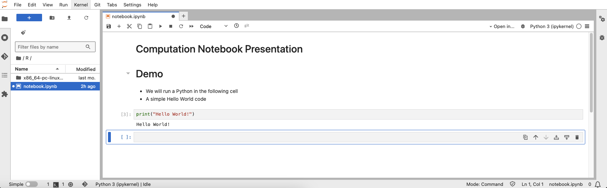
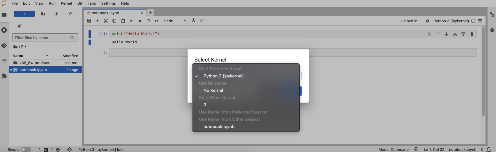
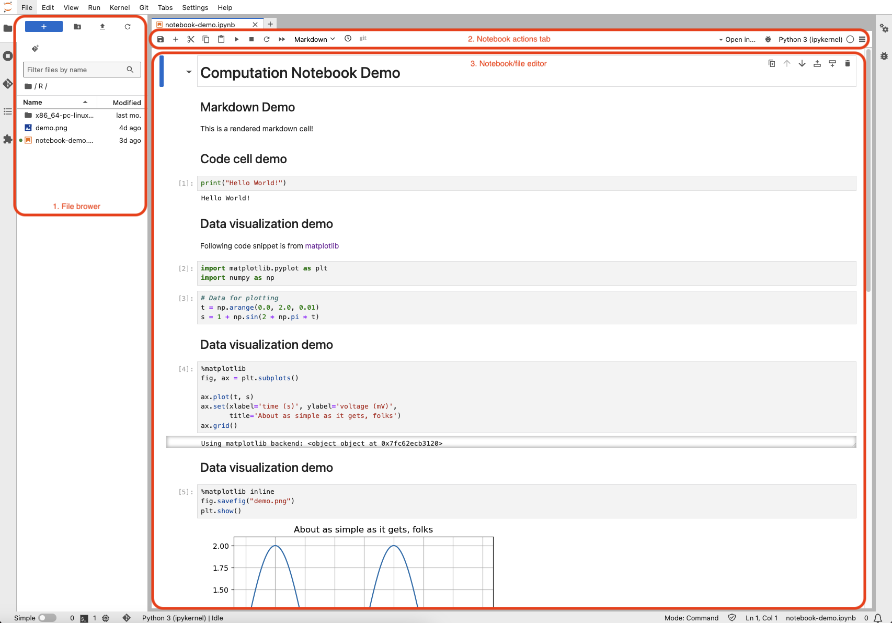
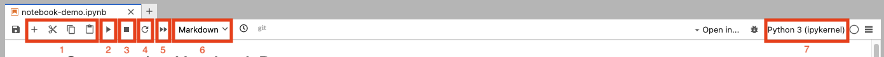
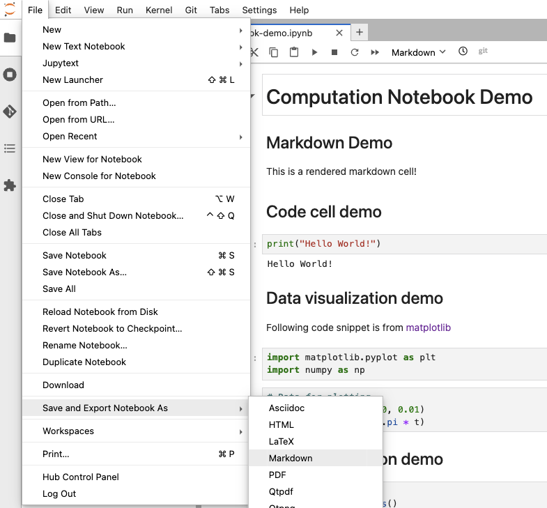
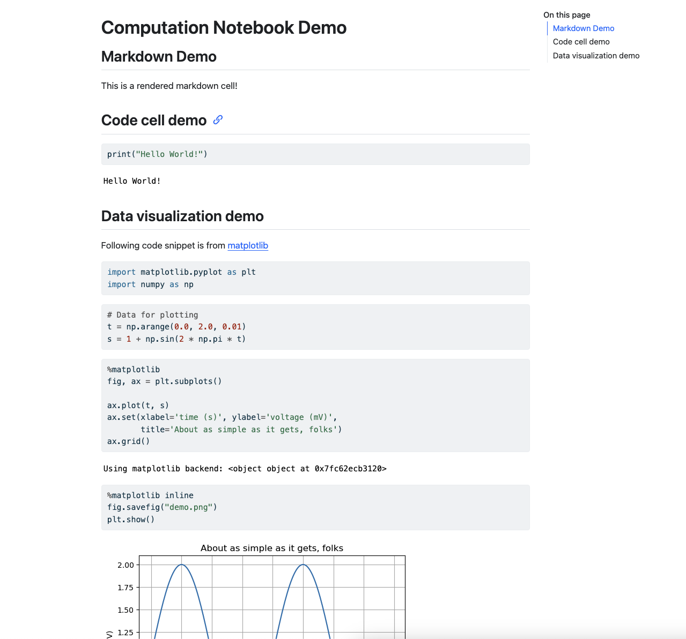

# Computational Notebook

A computational notebook is a virtual, interactive environment, similar to an integrated development environment (IDE), which allows users to develop and execute code while having the ability of visualizing code outputs and documenting workflow. Computational notebooks are commonly used in data science, machine learning and academic research because they combine code (e.g. Python, R), text (e.g. markdown) and multimedia (e.g. data visualization images) in a single document. By providing documentation, source code and methodology, computational notebooks help make research software code reproducible.  

[Jupyter Notebook](https://jupyter.org/) is one well-known example of computational notebook. [Google Colab](https://colab.research.google.com/) and [Syzygy](https://syzygy.ca/) are some cloud-based computational notebook services similar to Jupyter Notebook. Syzygy is a JupyterHub instance hosted by Pacific Institute for the Mathematical Sciences, Digital Research Alliance of Canada and Cybera to bring JupyterLab to researchers across Canada. The Digital Research Alliance of Canada hosts additional computational resources through their [JupyterHub cloud service](https://docs.alliancecan.ca/wiki/JupyterHub), available to researchers upon request.  

> What are JupyterLab and JupyterHub? How do they relate to Jupyter Notebook? Jupyter Notebook is often colloquially referred to two different concepts, the computational notebook file format and the basic interface to edit such file. JupyterLab offers a more integrated and extensible interface environment compared to the original Jupyter Notebook. JupyterHub is a deployable instance that supports multiple users running JupyterLab on the same server. In this learning module, we will mainly focus on Jupyter Notebook, JupyterLab and Syzygy (JupyterHub), and refer to them as "Jupyter".  

## Which Computational Notebook Should I Use?

|            | Self-hosted [JupyterLab](https://github.com/jupyterlab/jupyterlab) | Syzygy | Google Colab |
| ---------- | ------------------------------------------------------------------ | ------ | ------------ |
| Pricing/Performance | Free and open source, users will need to invest in computing hardware (e.g. CPUs, memory, GPUs) and maintenance costs to deploy the software and achieve the desired performance | Free for most Canadian educational institutions, no GPUs for allocation, limited resources to users (2GB memory & 1GB storage); intended primarily for testing or education | Free tier access comes with limited resources, while [Pro and Pro+ tiers](https://colab.research.google.com/signup) offer better performance with faster GPUs and more memory for data-intensive tasks and parallel computation |
| Data Security & Privacy | While users have full control over the security and privacy of their data, it also requires users to implement their own security measures in the setup if it is installed on a server for multi-users | Data is stored in the Arbutus computing cluster at the University of Victoria, data on user home directories are only accessible by the users themselves and the cluster admins at University of Victoria | While data is encrypted at rest and in transit, since data resides on Google's cloud infrastructure, data might be subject to [Google's own terms and services](https://research.google.com/colaboratory/faq.html) |
| Ease of Use (Onboarding) | Users will need to set up and maintain the instance, which requires a certain level of technical knowledge | Minimal setup required | Minimal setup required |

## A Beginner's Guide to Computational Notebook & Syzygy

> While we use Syzygy as the example for all the contents in this learning module, all instructions are relevant for JupyterLab, Google Colab and any JupyterLab-derivatives.  

## What's in a Computational Notebook?

Every notebook is an `.ipynb` file. The file is essentially a JSON file and attributes in the file describe all of the contents and metadata of the notebook. Platforms, like Syzygy, present the notebook as a development interface rather than a plain JSON file.  

In Syzygy, a notebook contains cells. A cell is the fundamental unit where users write and execute codes and text. The cell includes any textual/graphical outputs once it is executed. Cells can be executed individually, allowing users to test and debug small sections of the code in different sequences. Alternatively, users can execute the entire notebook and run all the codes sequentially.  

There are two types of cells: code cell and markdown cell. Code cells contain executable code. Where a code cell is executed, the notebook processes the code in the cell and displays the output directly below the cell. It can include anything from simple print statements to complex data visualizations.  



Markdown cells are generally used for documentation. Users can write formatted text using Markdown syntax or even create mathematical expressions with LaTeX. Markdown cells are great for providing explanations and context to the code cells.  

### Kernels

A kernel is the environment in which the notebook code executes. A user can specify code interpreters (e.g. Python and R), libraries and dependencies, all of which affect how the code in a notebook is executed. When a user runs a code cell, the code is actually executed within the kernel.  

In Syzygy, you can choose different kernels for your notebook. Simply click on the current kernel menu and it will give you the option to choose a kernel.  



### Syzygy Interface



1. File browser: this area includes all files in your Syzygy instance's root directory. You may upload notebooks, input files by drag-and-dropping files to the file browser or by cloning projects from Git with the "Git" option under the tab menu. 

2. Notebook actions tab: this area includes all actions for notebook, such as executing cells in the notebook and changing kernel used for the notebook. 

3. Notebook/file editor: this area displays all the cells (with outputs) in the notebook. You may drag-and-drop cells to change the order and structure of the notebook. 



1. Cell action buttons: Add, cut, copy and paste the selected cell with these buttons. 

2. Run cell button: Executes the code in the currently selected cell. If the cell contains code, it runs the code and displays the output below the cell. If the cell contains Markdown, it renders the Markdown as formatted text. 

3. Stop button: Interrupts the execution of the current cell. This is useful if you have a long-running or infinite loop that you need to stop. 

4. Kernel restart button: Restarting the kernel clears all variables and outputs, effectively resetting the notebook's state. This can be useful if the kernel becomes unresponsive or if you want to start fresh. 

5. Run all cells button: Executes all the cells in the notebook from top to bottom. This is useful for running the entire notebook to ensure that all code cells produce the sequential expected results. 

6. Cell type menu: Shows the type of selected cell (e.g. code, Markdown). You may change the cell type by selecting a different option from the menu. 

7. Kernel menu: Shows the selected kernel for the notebook. You may change the kernel by selecting a different option from the menu. 

## Computational Notebook and Research

Computational notebooks are well-adopted in the scientific community because of their tight integration with data, code and documentation and their interactive nature. They allow researchers to combine text explanations, equations and visualizations with executable code, making the research process transparent and reproducible.  

[Some research conferences](https://github.com/UCAR-SEA/SEA-ISS-Template) have adopted the requirements of notebook submission for presentations. This approach not only enhances the clarity and engagement of the presentation but also allows other conference attendees to replicate and verify the results, fostering a collaborative and open scientific environment.  

In the following sections, we will demonstrate how to use computational notebooks as a presentation tool.  

### Notebook to Presentation Slideshow

The same features that make computational notebooks effective at documenting and explaining methodologies and displaying results also make for effective slide shows for scientific and academic presentations. To make presentation slideshow using computational notebooks, you will need to install [Pandoc](https://pandoc.org/) on your local machine. While there are many other open source alternatives to Pandoc that offer similar format conversion features, Pandoc's combination of format versatility, customization and community support often makes it the preferred choice for many users.  

Once Pandoc is installed following the [system-specific installation instructions](https://pandoc.org/installing.html), go back to the Syzygy interface. Select "File" under the tab menu, you will see the option "Save and Export Notebook As," then export the notebook as markdown file. This action downloads the markdown file and all the visualizations in the notebook as separate PNG files.  



Open the command prompt on your system and navigate to the directory containing all uncompressed export files. Run the following command:  

```bash
pandoc -t beamer -s <notebook_name>.md -o <slideshow_name>.pdf -V theme:Warsaw
```

`-t` flag specifies the renderer used during the conversion. Since we are generating PDF slideshow, we use the [beamer](https://en.wikipedia.org/wiki/Beamer_(LaTeX)) renderer the markdown file and all visualizations in this case. Users may also use s5, slidy, slideous, dzslides or revealjs as renderer to generate HTML slideshow.  

`-V theme:Warsaw` specifies the beamer slideshow theme used during the conversion. Warsaw is one of the default theme that comes with the Pandoc installation.  

<embed src="https://github.com/McMasterRS/lmr_computational-notebook/notebook-demo-md2pdf/notebook-demo.pdf" style="border:none;" width="100%" height="466px">

### Notebook to Minimal Computing Website

Computational notebooks can be converted to a website for sharing and displaying its contents. The resulting static websites have minimal dependencies which result in simple, [minimal computing-style](https://mcmasterrs.github.io/lm_minimal-computing) websites that will operate well into the future with little or no changes (i.e. "durable"), and be operable by many users with minimal dependencies to be installed.  

While Syzygy and Pandoc support conversion to static HTML files, it does not offer a streamlined experience for deploying the notebook as a website. Hence, we will use [Quarto](https://quarto.org/) to export the notebook contents to a website. Follow the [system-specific installation instructions](https://quarto.org/docs/get-started/) to install Quarto.  

Back in Syzygy, select "File" under the tab menu, and you will see the option to download your notebook. Open the command prompt on your system and navigate to the directory containing the notebook.  

Create a [`_quarto.yaml`](https://quarto.org/docs/reference/projects/websites.html) file with the following content.  

```yaml
project:
  type: website # or other types like book, default, etc.
  output-dir: _site # directory where the rendered files will be saved
  title: "Computational Notebook"

render:
  - notebook-demo.ipynb  # path to your notebook file

format:
  html:
    toc: true
    html-math-method: katex
    code-tools: true
    self-contained: true
```

The snippet above defines the formatting style for the HTML export and rendering configuration. There are different styles a user can apply, check out some examples from the [Quarto Gallery](https://quarto.org/docs/gallery/). Then run the following command:  

```bash
quarto render
```

You will then see the static HTML file created in the same directory. Nonetheless, Quarto goes beyond just generating HTML files. In our [Introduction to Minimal Computing learning module](https://mcmasterrs.github.io/lm_minimal-computing), we demonstrate how to host a minimal computing site with GitHub Pages. Quarto supports direct conversion deployment every time the notebook's changes are pushed to GitHub.  

Once you've pushed your notebook and all files (e.g. assets, `_quarto.yaml`) to your repository. You may run the following command to instruct Quarto to render and publish your GitHub Pages website in your repository.  

```bash
quarto publish gh-pages
```



Then there's your notebook as a styled minimal computing site on GitHub Pages. You may also create a GitHub Action workflow to automatically render and publish a new website every time you push new changes to the repository.  

Create a `.github/workflows` directory in your repository root directory. Inside the `workflows` directory, add a `publish.yaml` file with the following content.  

```yaml
on:
  workflow_dispatch:
  push:
    branches: ["main", "master"]

name: Quarto Publish

jobs:
  build-deploy:
    runs-on: ubuntu-latest
    permissions:
      contents: write
    steps:
      - name: Check out repository
        uses: actions/checkout@v4

      - name: Set up Quarto
        uses: quarto-dev/quarto-actions/setup@v2

      - name: Render and Publish
        uses: quarto-dev/quarto-actions/publish@v2
        with:
          target: gh-pages
        env:
          GITHUB_TOKEN: ${{ secrets.GITHUB_TOKEN }}
```

## Reference

- [Producing Beamer slide shows from markdown using Pandoc](https://ashwinschronicles.github.io/beamer-slides-using-markdown-and-pandoc)
- [Quarto - GitHub Pages](https://quarto.org/docs/publishing/github-pages.html)
