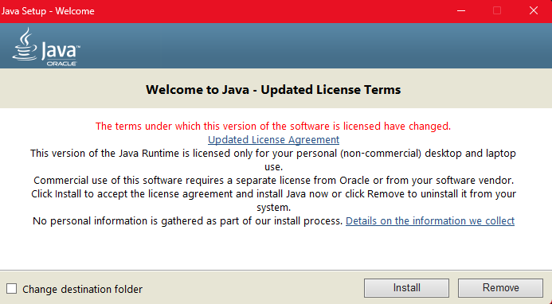
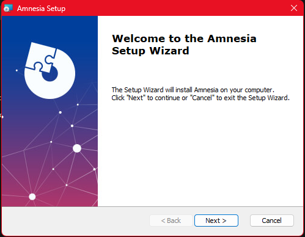
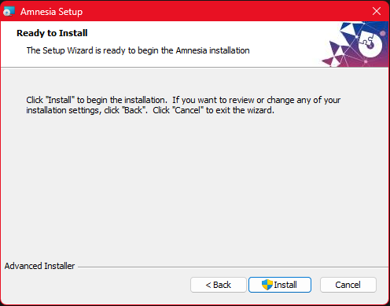
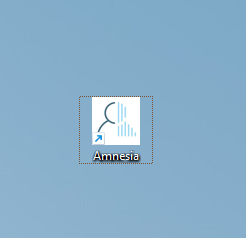
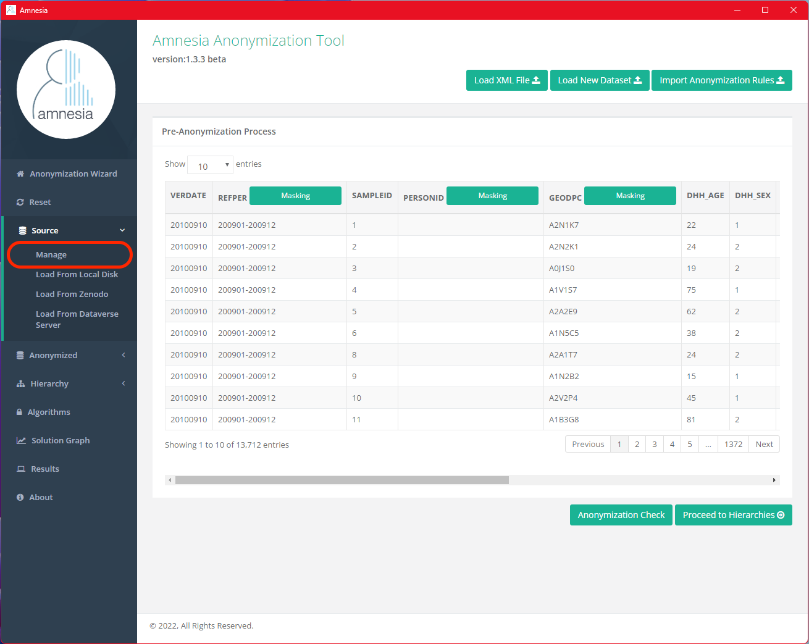

# Data Anonymization

Depositing and sharing research data are fundamental to advancing research. However, these data can be weaponized by malicious actors to harm individuals and society. Some research data contain sensitive information. Research involving human participants, for example, carries critical ethical responsibilities to ensure the protection and respect of participants, as they might be subjected to targeting or retaliation due to the information they have provided. Research data that include human participants, endangered species, sensitive ecological information, or confidential business information often contain private or sensitive information that cannot be published due to legal and ethical constraints.  

Furthermore, there are regulations that govern the collection, use and distribution of sensitive information.  

Accountability, Identifying Purposes, Consent, Limiting Collection, Limiting Use/Disclosure/Retention, Accuracy, Safeguard, Openness, Individual Access and [Challenging Compliance](https://learn.scds.ca/intro-rdm/sensitive.html) are some of the privacy principles underpin these Canadian and international privacy legislation. If the research or funding bodies cross jurisdictions it may be necessary to conform to regulations of multiple regions. Local ethics boards are a good source of regulations and restrictions that may apply.  

To balance these privacy and ethical concerns, there are techniques and tools designed to reduce the sensitivity of these data while maintaining their research value, which can make deposited data more broadly accessible and reusable.  

In the following sections, we will discuss the types of variables in a dataset that should be anonymized and describe the process of anonymizing a tabular dataset using [Amnesia](https://amnesia.openaire.eu/index.html), a data anonymization tool developed by [OpenAIRE](https://www.openaire.eu/).  

## Direct Identifiers and Indirect/Quasi-identifiers 

Sensitive identifiers in a dataset are pieces of information that can be used to identify an individual. Attributes such as name, physical address, health record IDs, and government IDs are considered direct identifiers, placing research participants at immediate risk of re-identification.  

However, some datasets may include quasi-identifiers. Quasi-identifiers are indirect identifiers that can lead to re-identification when combined with external information or known context, or even with non-identifiable properties within the dataset. For example, consider the statement: "I'm looking for a person living in Hamilton, who is female, married, has a master's degree, is between the ages of 25 and 35, and has an annual income between 80 and 90 thousand dollars." Geographic identifiers, gender identity, marital status, age, and socioeconomic status (education and income information) might not seem sufficient to identify an individual in a dataset. However, when contextualized, for example, limiting the dataset to staff working at McMaster University, the risk of re-identification increases significantly. Hence, quasi-identifiers need to be evaluated in the context of what is known or inferred about the study's population. [Dimension attributes (versus facts)](https://www.linkedin.com/advice/3/how-do-you-select-right-dimensions-your-data-skills-statistics) in a dataset, which are attributes that describes the data, often contribute to the identifiability of the source of the data (e.g. when, where, who) and may be quasi-identifiers.  

Sensitive identifiers in a dataset are pieces of information that can be used to identify an individual. Attributes such as name, physical address, health record IDs, and government IDs are considered direct identifiers, placing research participants at immediate risk of re-identification. To help identify these data, the Portage Network has published [a guidance document on de-identification](https://doi.org/10.5281/zenodo.4042022), which includes a comprehensive list of direct sensitive identifiers based on various sources (e.g. the British Medical Journal, US HIPPA). Additionally, the Office of the Privacy Commissioner of Canada has issued [a brief requirements guidance on The Personal Information Protection and Electronic Documents Act (PIPEDA)](https://www.priv.gc.ca/en/privacy-topics/privacy-laws-in-canada/the-personal-information-protection-and-electronic-documents-act-pipeda/pipeda_brief/), which includes a list of identifiable personal information that should be protected.  

To help identify these identifiers in data, the Portage Network has published [a guidance document on de-identification](https://doi.org/10.5281/zenodo.4042022), which includes a comprehensive list of direct and indirect identifiers based on various sources (e.g. the British Medical Journal, US HIPPA). Additionally, the Office of the Privacy Commissioner of Canada has issued [brief requirements guidance on the PIPEDA](https://www.priv.gc.ca/en/privacy-topics/privacy-laws-in-canada/the-personal-information-protection-and-electronic-documents-act-pipeda/pipeda_brief/), which includes a list of identifiable personal information that should be protected.  

Both sensitive identifiers and quasi-identifiers need to be considered when evaluating the identifiability, and thereby its associated risk, before sharing these data.  

## Anonymization and De-identification

The simplest and most effective way to de-identify data is to remove identifying information (e.g. subject’s name, address). To maintain research integrity, these identifying data are stored in a separate table with restricted access, keyed with a code. These identifying data are then linked back to the original research data using this code key. However, the remaining data may still have identifying details which cannot be removed without reducing the research utility of the data.  

Two techniques are described herein to reduce the sensitivity of these data by anonymising or de-identifying data: suppression and generalization.  

Suppression involves masking certain data elements to prevent identification, for example, masking postal code "L8S 4L8" as "L8S" or "L8S XXX." While generalization involves modifying the data to make it less specific, for example, replacing age values to age range (e.g. replace Age (years) value of "28" with generalized range "25-30"). A risk of re-identification remains if the data is not suppressed or generalized sufficiently, especially when used in conjunction of other data.  

The effect of both techniques is to reduce the risk of a third party identifying the source of the data, which would otherwise pose a privacy risk to the participants. By applying these techniques effectively, researchers can enable sharing research data while maintaining confidentiality.  

The terms anonymization and de-identification sometimes have formal definitions by various government, ethics and privacy bodies. However, these definitions are not used consistently across these bodies. We make no specific distinction between these terms herein. Instead, we focus on the techniques that can be applied.  

## *K*-anonymity

Once the quasi-identifiers in a dataset have been identified, what can one do to anonymize the data? There are numbers of statistical approaches one can use to quantify the level of identifiability of a dataset and apply de-identification techniques, one of which is [*k*-anonymity](https://doi.org/10.1197/jamia.M2716).  

*K*-anonymity is a mathematical approach to ensure each individual (i.e. a row of record) in a tabular dataset cannot be distinguished from at least *k*-1 other individuals with respect to the quasi-identifiers in the dataset, where *k* is an integer selected to  be the target number of records with the same information across all the quasi-identifiers in a datasets.  

| Row | Age | Sex | City | In Favour of Strike? |
| --- | --- | --- | ---- | -------------------- |
| 1 | 22 | Female | Hamilton | Yes |
| 2 | 22 | Male | Oakville | No |
| 3 | 23 | Male | Oakville | Yes |
| 4 | 24 | Male | Oakville | Yes |
| 5 | 25 | Female | Burlington | Yes |
| 6 | 26 | Female | Hamilton | Yes |
| 7 | 28 | Female | Burlington | No |
| 8 | 31 | Male | Hamilton | Yes |
| 9 | 32 | Male | Hamilton | No |
| 10 | 34 | Male | Hamilton | Yes |

If one were to look for a female staff living in Burlington and is of age 28, they can immediately identify row 7 contains information of the person they look for. The staff’s choice on supporting strike action is now exposed and they might be targeted for retaliation.  

Now, let's apply *k*-anonymity to the dataset and see what happens. We will choose *k* = 2 as a target, so that all records in the dataset cannot be distinguished from at least 1 other record with respect to the quasi-identifiers.  

| Row | Age | Sex | City | In Favour of Strike? |
| --- | --- | --- | ---- | -------------------- |
| 1 | 20-30 | Female | Hamilton | Yes |
| 2 | 20-30 | Male | Oakville | No |
| 3 | 20-30 | Male | Oakville | Yes |
| 4 | 20-30 | Male | Oakville | Yes |
| 5 | 20-30 | Female | Burlington | Yes |
| 6 | 20-30 | Female | Hamilton | Yes |
| 7 | 20-30 | Female | Burlington | No |
| 8 | > 30 | Male | Hamilton | Yes |
| 9 | > 30 | Male | Hamilton | No |
| 10 | > 30 | Male | Hamilton | Yes |

Again, if one were to look for a female staff living in Burlington and is of age 28, they can identify rows 5 and 7 might contain the information of the person they look for. However, they cannot distinguish between the two rows and narrow down to get the person's information they want. So are the other records in the set, there are now at least 2 record rows in each unique sets of quasi-identifiers (age, sex and city), which is *k*-anonymity for *k* = 2.  

*k* = 2 might not be a practical anonymity in real world, but this example demonstrates application of this *k*-anonymity statistical approach to reducing the identifiability of data.  

## Amnesia

Some people opt to anonymize data by hand. However, as the size of the dataset grows, the process becomes more complex. There are software tools that assist with the data anonymization. Amnesia is one such tool developed by OpenAIRE and [Athena Research Center](https://www.athenarc.gr/en/home).  

OpenAIRE supports Open Science in Europe by providing tools and services for Open Access and Research Data Management. Athena Research Center in Greece advances knowledge in Informatics and Computational Sciences through high-impact research and innovation. Both organizations are deeply involved in promoting Open Science and collaborate on various projects to enhance research accessibility and data management.  

Amnesia, with its simplistic graphical interface and no need for programming knowledge, allows users to easily transform datasets containing sensitive direct identifiers and quasi-identifiers into k-anonymous data suitable for statistical analysis.  

In Amnesia, k-anonymity is achieved by suppression and generalization. **Suppression** involves masking certain data elements to prevent identification, for instance, masking postal code "L8S 4L9" as "L8S" or "L8S XXX."  

**Generalization** involves modifying the data to make it less specific, for example, replacing age values to age range (e.g. replace Age (years) value of "28" with generalized range "25-30").  

We will demonstrate how Amnesia works in action using a synthetic dataset.  

> Health Statistics Division, 2023, "Synthetic: Canadian Community Health Survey, 2009: Sub-Sample File [Canada]", [https://doi.org/10.5683/SP3/30OXE0](https://doi.org/10.5683/SP3/30OXE0), Borealis, V1 

You may download the dataset from Borealis to follow along. For demonstration purposes, we will reduce the number of columns in the dataset file (`synthetic-CCHS-E-2009-SubSampleFile_F1.csv`) and remove any columns except the following using Microsoft Excel or similar tools:  
- `VERDATE`: Date of file creation 
- `REFPER`: Reference period 
- `SAMPLEID`: Household identifier 
- `PERSONID`: Person identifier of respondent selected - health interview 
- `GEOPC`: Postal code of respondent 
- `DHH_AGE`: Age of respondent 
- `DHH_SEX`: Sex of respondent 
- `GEN_01`: Health Question Answered by respondent 
- `GEN_02`: Health Question Answered by respondent 
- `GEN_02A2`: Health Question Answered by respondent 
- `GEN_02B`: Health Question Answered by respondent 
- `GEN_07`: Health Question Answered by respondent 
- `GEN_08`: Health Question Answered by respondent 
- `GEN_09`: Health Question Answered by respondent 
- `GEN_10`: Health Question Answered by respondent 
- `GENDHDI`: Health Question Answered by respondent 
- `GENDMHI`: Health Question Answered by respondent 
- `GENGSWL`: Health Question Answered by respondent 

### Installation

Amnesia is Available for both Windows and Linux. The following guide describes the installation instructions in Windows environments.  

Amnesia requires a Java Runtime Environment with Java version 8 or greater. You can download Java Runtime Environment installation executable from the [official Oracle website](https://www.java.com/download/ie_manual.jsp). Simply run the downloaded executable to install the required Java Runtime Environment.  

Once the Java Runtime Environment has been installed on your machine, download the Amnesia installation executable from the [Amnesia website](https://amnesia.openaire.eu/download.html). Run the executable and you will see a `.jar` application file in the Desktop folder after installation is completed.  

Start Amnesia by clicking the application icon in Desktop.  

### Load Dataset to Amnesia

Select the CSV file you want to de-identify by drag-and-dropping the file to the interface or selecting the file using the "Upload sensitive data" button. Once you've selected the desired file, click "Upload." Rest assured, your data will not be "uploaded" to an unknown remote server. Amnesia starts a local service on the computer where you installed Amnesia, and any data storage/processing will happen within your server. If the installed machine is your personal computer, data transfer, storage and processing happen entirely within your PC on the localhost. To achieve maximum data protection, it is recommended to use Amnesia in an offline and/or encrypted machine to anonymize sensitive data.  

After you've "uploaded" the file, you will be redirected to dataset preview page. This process might take a few minutes if you have a large CSV.  

> TIP: for large datasets, users are advised to remove some non-identifiable columns in the dataset to while they test the anonymization algorithms to make it faster to test different options. This was the main reason of why we reduced the number of columns in the demonstration synthetic dataset initially. DO NOT remove rows of data, as these rows are important for the *k*-anonymity statistics. Once the appropriate hierarchies and algorithms have been identified for the test data, they can then be applied to the complete dataset. 

Select "Simple table" as the dataset type and enter the delimiter used in the file (in this case a comma, since CSV, Comma Separated Value, uses comma as the delimiter) Other data files might use different characters as the delimiter, such as a semicolon (`;`), a dollar sign (`$`) or even a tab. Then continue to the next page by clicking the "Next" button.  

Next, select the data attributes (dataset columns) in the anonymization process and assign a data type to each attribute. The selected attributes will be included in the resulting dataset. By default, Amnesia selects all the data attributes found in the file and assigns either `int` (integer number), `string` (text/sequence of characters) or `decimal` (decimal number) to the attributes. Finally, click "Finish" to complete the data loading process.  

The initial data type auto-assignment by Amnesia infers the data type from the first few rows without processing the entire data file. As a result, it may make incorrect inferences that are not correct for the entire dataset. Amnesia will warn users about these possible data type issues during the final loading process. If any inconsisten cies are found, the user will be prompted to correct some type assignments before proceeding.  

### Generate Generalization Hierarchy

To generalize values of an attribute/data column, a hierarchy is needed. Generalization hierarchies are a set of rules that define how specific values should be substituted by more general ones in anonymizing the data. For instance, a quasi-identifying property ranging from 16 to 100 can be generalized into a range groups set, each group is of size 5 (i.e. 16-20, 21-25, 26-30 and so forth). It can be generalized into a different range group set, each group is of size 20 (i.e. 16-35, 36-55, 56-75 and so forth). The generalization will have an impact on the utility of the property in the resulting dataset.  

To demonstrate, let's generate a generalization hierarchy with the `DHH_AGE` column in Amnesia. Click "Hierarchy" on the side menu and select "Auto Generate" from the drop-down menu.  

Select `DHH_AGE` as the Attribute. Since our goal is to generalize the values in the `DHH_AGE` column to different age ranges, we will select "Range" as the Hierarchy type. Then, continue by clicking "Next."  

Enter the [hierarchy information](https://amnesia.openaire.eu/AmnesiaHierarchyTutorial.pdf), step, name of the hierarchy, domain of column values and fanout of the generalization. Fanout is a parameter used to specify the number of children of each node in the resulting generalization tree (i.e. the hierarchy), and Step is a parameter that specifies the size of ranges into which the domain is partitioned. Since the column selected is numeric, Amnesia should be able to automatically detect and fill in the step, domain and fanout values.  

Updating the fanout value will change the number of ranges available for the column values. In this case, if we update the fanout value for `DHH_AGE` column to 5, there will be 5 different age ranges in the later anonymized dataset. Users are advised to experiment with these generalization parameters and explore the resulting Algorithm options (below) to choose the best set that balances privacy protection and data utility.  

Finally, click "Finish" after filling in the information to generate the hierarchy for review.  

Amnesia will generate the resulting hierarchy, with a fanout value of 9 (i.e. 9 non-null children of the root node in red color).  

### Anonymize the Dataset by Suppression

Once we have the generalization tree for `DHH_AGE`, we will apply anonymization to `GEODPC` and `DHH_AGE`. For now, we will choose *k* to be 100 to generate a 100-anonymous dataset. We will discuss some considerations when selecting a *k*-value at the end.  

First go back to pre-anonymization preview, click "Source" on the side menu and select "Manage" from the drop-down menu. Select the "Masking" button in the `GEODPC` column to apply a mask to the postal codes.  

Choose a mask character (we will use `X` in this case), select positions of the postal code string to mask (i.e. the last 3 characters) and then click "Save."  

The last 3 characters of all values in the `GEODPC` column are now replaced with `X`.  

Next, go to anonymization algorithm page, select "Source" on the side menu.  

Scroll down the page to find the "Bind Hierarchies with Attributes" section. We will bind the previously created hierarchy, Age, with `DHH_AGE`. Then, in the "Algorithm Parameters" section, enter 100 for the *k* value and click "Execute."  

Once the algorithm is executed, you will be directed to the anonymization solutions graph view. The blue nodes in the graph indicate safe solutions and red indicate unsafe solutions. Each blue nodes contain safe solutions with different level of generalization and might not be applicable in some usages. Click on the nodes to preview the results and export the one you are satisfied with most in terms of the balance between data privacy and data utility.  

## Final Note

There is no hard requirement in choosing which *k*-value to use during the anonymization process. It is dependent on the characteristics of the dataset, such as utility, size, and sensitivity and risk level of the dataset.  

The size and diversity of the dataset significantly influence the choice of a good *k* value. Larger and more diverse datasets can support higher *k* values without significantly loss of utility, while smaller datasets may require lower *k* values. For example, choosing a *k* value of 10 for a dataset with 5000 records, so that all 5000 records in the dataset cannot be distinguished from at least 9 other records with respect to the quasi-identifiers, provides more granularity and usefulness of the data for analysis than choosing a *k* value of 10 for a dataset with just 50 records.   

The risk level and sensitivity of the dataset determine the level of anonymity it needs to achieve.  

Conducting a risk assessment, evaluating the sensitivity and identifiability of the data, and the data storage repository option(s), can help determine an acceptable *k* value that balances privacy and utility. Sharing the data by storing it with unrestricted access on a public repository (e.g. [Borealis](https://borealisdata.ca/), [FRDR](https://www.frdr-dfdr.ca/repo/)) would need the data to be more thoroughly anonymized with a larger *k* value to protect information of research participants. In comparison, the original, identifiable data may need to be stored with restricted access on secure storage (e.g. institutional encrypted data storage, [McMaster University's Secure Empirical Analysis Lab](https://seal.mcmaster.ca/), [Digital Research Alliance Canada’s Controlled Access Management Pilot](https://alliancecan.ca/en/funding-opportunities/controlled-access-management-research-data)).  

Balancing privacy with loss of utility is specific to each dataset and is, unavoidably, for the researcher to evaluate. Some datasets, due to limited size, unavoidable identifiability, specific context or significant sensitivity, may not have an appropriate *k* value that sufficiently anonymizes the dataset to be shared openly. *K*-anonymization is a useful technique applicable to a broad range of data, but it does have its limitations.  

The necessary security and privacy measures are best worked out between the researcher and the relevant ethics and privacy bodies, ideally at the initial design stage of the research. This may include not collecting identifying data that do not serve any utility to the research question.  

*K*-anonymity is not the only statistical method to assess the level of identifiability of a dataset. Other methods, such as [*L*-diversity and *T*-closeness](https://utrechtuniversity.github.io/dataprivacyhandbook/k-l-t-anonymity.html), while are not supported by Amnesia, might also be useful in de-identifying your datasets. There are other software tools available to apply these additional techniques and measure the identifiability with a dataset, such as [sdcMicro](https://sdctools.github.io/sdcMicro/index.html) and [ARX](https://arx.deidentifier.org/), and may be worth exploring further.  
