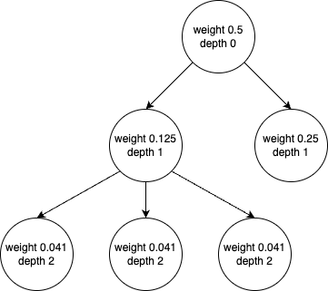

# Transitive Crediting System

Modern research produces a wide variety of outputs (including publications, datasets, and software) that have value both as parts of an overarching research project and as discrete entities that can be reused, modified, and expanded. Historically, the research community has prioritized publications as the primary source of impact, leading to systematic approaches for assigning credit and assessing impact at the publication-level. Conversely, outputs like datasets and software lack clear procedures for accrediting contributors, which leads to a significant underestimation of these contributors' role in the research process and makes it difficult to understand the true impact of their work.  

According to the UK's [Research Excellence Framework in 2021](https://results2021.ref.ac.uk/), digital research artifacts, like data and software, contributed to less than 5% of the participating institutions' overall scholarly outputs, even though research data and research software contributed significantly during research projects. The efforts spent on these digital artifacts are not recognized the same way as research publications, which could greatly hinder research reproducibility and ultimately impact research integrity.  

One reason attributed to this deficit is the lack of a systematic method for accrediting and evaluating the impact of these non-traditional research outputs. Widely supported movements like the [San Franciso Declaration on Research Assessment (DORA)](https://sfdora.org/) and [the Coalition for Advancing Research Assessment (CoARA)](https://coara.eu/) stress the importance of expanding traditional approaches to research assessment to include all outputs produced during the research process. Any such expansion, however, must consider the distinct ways in which these emerging outputs are created.  For example, current best practices identify persistent identifiers (e.g. DOIs) as the preferred method for citing software.  However, software is not usually self-contained, meaning it is typically composed of multiple other software dependencies. It is important to recognise and accredit the authors of these dependencies that help build the software during the research process and, in these instances, a single DOI for the final software output may not be sufficient.  

In 2015, Daniel Katz and Arfon Smith [proposed a transitive crediting system](https://doi.org/10.5334/jors.be) for assigning credits to software that contributed during the research process and the people who developed the software. The transitive crediting system has three components. First, the credit. The research software should list all the authors of the publication the software helped to produce, contributors that developed the research software as well as all the software dependencies. Second, weight scores to the credits. The weight score indicates how much a contributing entity assists in creating the research software. Third, the transitive nature of credits. If a software is dependent on library A, which library A is also dependent on library B and C, then the software should also assign weighted credits to library B and C.  

## CiteLang

In 2022, [the first proof-of-concept software for the transitive crediting system](https://doi.org/10.21105/joss.04458), [CiteLang](https://github.com/vsoch/citelang), was created. CiteLang assists with software citation by generating software credits using artifacts generally present in a software project, such as dependency list files and version control history, rather than traditional research metadata artifacts like `CITATION.cff`, CodeMeta, and DOIs.  

### Generate Software Credits with a Dependency List

A dependency list file describes the necessary software artifacts to build and execute the software and is usually included in the project directory along with the source code. In Python and PIP (Package Installer for Python), a dependency list file is typically a `requirements.txt` file. In JavaScript/TypeScript and NPM (Node Package Manager), it usually comes as a `package.json` file.  

CiteLang can read these dependency list files and generate credits for the listed packages and generates credits for the dependencies of those packages based on the number of co-dependencies and how far removed it is from the original software.  

The algorithm used by CiteLang to allocate credit is based on the breadth and depth of the dependency tree.  



Once the calculated weight value or depth drops below a certain threshold (`min-credit` or `max-depth` parameters set by users), the algorithm stops traversing further levels of that subtree.  

For example, consider the following dependency list files:  

`requirements.txt`:  

```txt
pandas
requests
```

`package.json`:  

```json
{
  "name": "package.json",
  "version": "1.0.0",
  "description": "Original version of this document copied from [yarnpkg](https://yarnpkg.com/lang/en/docs/package-json/).",
  "main": "index.js",
  "scripts": {
    "toc": "markdown-toc -i --maxdepth 3 README.md"
  },
  "repository": {
    "type": "git",
    "url": "git+https://github.com/stereobooster/package.json.git"
  },
  "author": "",
  "license": "MIT",
  "bugs": {
    "url": "https://github.com/stereobooster/package.json/issues"
  },
  "homepage": "https://github.com/stereobooster/package.json#readme",
  "dependencies": {
    "markdown-toc": "^1.2.0"
  }
}
```

```bash
citelang gen pypi requirements.txt
```

```bash
citelang gen npm package.json
```

`gen` is the command argument for generating software credits. `pypi`/`npm` is an argument specifying package manager for the parsed dependency list file.  

Output 1:  

```md
# Software Credit

<!--citelang start-->
|Manager|Name|Credit|
|-------|----|------|
|requirements.txt|pypi|0.5|
|pypi|[pandas](https://pandas.pydata.org)|0.25|
|pypi|[requests](https://requests.readthedocs.io)|0.12|
|pypi|[charset-normalizer](https://charset-normalizer.readthedocs.io/en/latest/)|0.02|
|pypi|[idna](https://pypi.org/project/idna)|0.02|
|pypi|[urllib3](https://urllib3.readthedocs.io)|0.02|
|pypi|[certifi](https://github.com/certifi/python-certifi)|0.02|
|pypi|[PySocks](https://github.com/Anorov/PySocks)|0.02|
|pypi|[chardet](https://github.com/chardet/chardet)|0.02|


> Note that credit values are rounded and expanded (so shared dependencies are represented as one record) and may not add to 1.0. Rounded values that hit zero are removed.

<!--citelang end-->

- Generated by [CiteLang](https://github.com/vsoch/citelang)
```

Output 2:  

```md
# Software Credit

<!--citelang start-->
|Manager|Name|Credit|
|-------|----|------|
|package.json|npm|0.5|
|npm|[markdown-toc](https://github.com/jonschlinkert/markdown-toc)|0.25|
|npm|[concat-stream](https://github.com/maxogden/concat-stream#readme)|0.02|
|npm|[diacritics-map](https://github.com/jonschlinkert/diacrictics-map)|0.02|
|npm|[gray-matter](https://github.com/jonschlinkert/gray-matter)|0.02|
|npm|[lazy-cache](https://github.com/jonschlinkert/lazy-cache)|0.02|
|npm|[list-item](https://github.com/jonschlinkert/list-item)|0.02|
|npm|[markdown-link](https://github.com/jonschlinkert/markdown-link)|0.02|
|npm|[minimist](https://github.com/minimistjs/minimist)|0.02|
|npm|[mixin-deep](https://github.com/jonschlinkert/mixin-deep)|0.02|
|npm|[object.pick](https://github.com/jonschlinkert/object.pick)|0.02|
|npm|[remarkable](https://github.com/jonschlinkert/remarkable)|0.02|
|npm|[repeat-string](https://github.com/jonschlinkert/repeat-string)|0.02|
|npm|[strip-color](https://github.com/jonschlinkert/strip-color)|0.02|
|npm|[gulp-format-md](https://github.com/jonschlinkert/gulp-format-md)|0.02|
|npm|[mocha](https://mochajs.org/)|0.02|


> Note that credit values are rounded and expanded (so shared dependencies are represented as one record) and may not add to 1.0. Rounded values that hit zero are removed.

<!--citelang end-->

- Generated by [CiteLang](https://github.com/vsoch/citelang)
```

### Generate Developer Credits with Git Commit History 

Commit history in a project's version control system is a valuable source of provenance for the software project. It documents the description of changes, the author of the changes, and the reviewer. CiteLang utilizes commit history in Git to generate credits for all the project contributors. 

```bash
citelang contrib --start db3ed7135a39c545caa8f89e6f4cbd1ac1774054 --end 7f57a7d9614d314657134812a6a140a94e1531b5
```

`contrib` is the command argument for generating developer credits with Git commits. By default, the command searches `.git` directory in the present working directory.  

`--start` and `--end` are optional flags specifying the starting and ending range of commits.  

```bash
Found 17 commits.
                                ┏━━━━━━━━━━━━━━━━━━━━┳━━━━━━━┓                                 
                                ┃ Name               ┃ Count ┃                                 
                                ┡━━━━━━━━━━━━━━━━━━━━╇━━━━━━━┩                                 
                                │ Vanessasaurus      │ 221   │                                 
                                │ github-actions     │ 18    │                                 
                                │ github-actions     │ 15    │                                 
                                │ vsoch              │ 13    │                                 
                                │ HY. Kelvin Lee     │ 13    │                                 
                                │ Traceton Timmerman │ 1     │                                 
                                └────────────────────┴───────┘ 
```

The output shows a summary of code lines of contribution for each contributor in the list in the specified commit range.  

### What's Next?

Now that CiteLang has generated credits for the software packages and the people that built the project, what's next? Publish your research results and software with the credit outputs. For instance, adding the credit in the documentation (e.g. README) in your software repository, or including the credit in the acknowledgements of your publications.  

Research software is often built with software packages by developers who may not have a scholarly or academic research background. Persistent identifiers, such as ORCID IDs and DOIs, might be unfamiliar to these contributors. Nonetheless, it is important to acknowledge their contributions by accrediting the developers in your publication. These transitive credits can positively impact their social recognition, hiring, and promotion decisions, and incentivize more talented developers without a research background to contribute to open research software. An ideal transitive credit system should not only encompass only research software but also all scholarly outputs, both traditional and non-traditional (e.g. data, other digital products).  

While a proper transitive crediting system has not yet been widely adopted in the academic research community, the benefits of such systems—such as increasing research integrity and transparency, and encouraging diverse talents to contribute to better research outputs—cannot be overlooked.  
